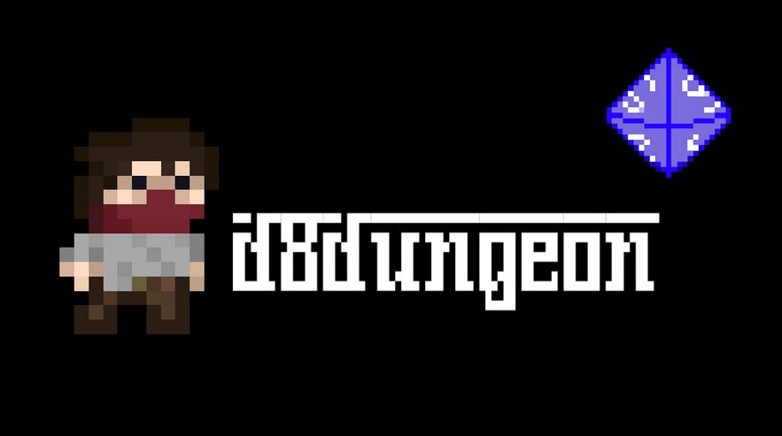
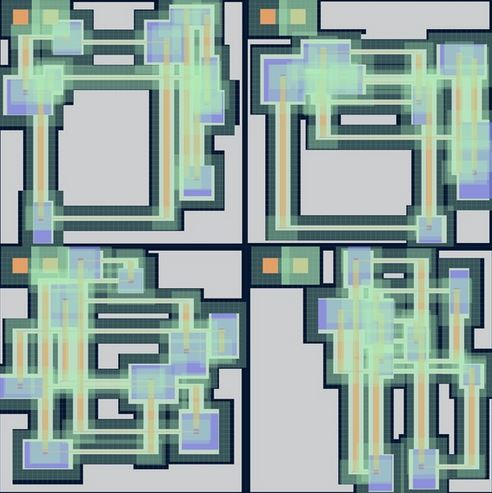
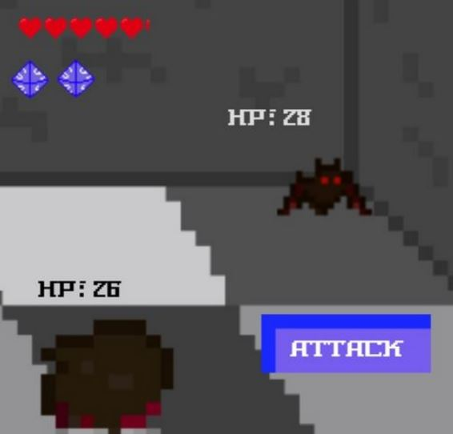

# d8dungeon

This project was authored by Christina Zhang and Elias Hudson (jambouree) in Fall 2020.

- - - -
## Inspiration

Elias and I both have had our share of late-night D&D campaigns consisting of conjuring incantations and raiding strongholds. We also love the element of delightfully surprising design in art, music, and games. Our concept blends the two in a fun, strategy-based rogue-like game. Influenced by various programming algorithms, such as Bresenham's Line Algorithm of drawing paths and procedural generation, we sought to create a complex and interesting pixel game experience.

- - - -
## What it does

The game is constructed with an "intelligent generation" layout, where rooms are positioned randomly in the map, each one accessible and connected through hallways. The random map construction allows for unique player experiences. In addition, random enemies spawn with different appearances, damage-modifiers, and HPs associated with their type. When the player is in their line of sight, they engage in a grid-like movement toward the player. The player can also pick up items, namely the d8 die and HP potions that boost max health. When a player engages in combat with an enemy (or vice-versa!), the user can make an attack that is modified by the number of d8 die they have picked up in-game. If the player dies in combat, the death sequence plays, and they are spawned in an different, newly-generated dungeon; whereas, if the player defeats the enemy, they resume exploring the current map. All of assets were built from scratch. All images and sounds used in this project were made in GIMP or Bitwig Studio.

- - - -
## Contact
christinazhang2013@gmail.com

*4 different maps generations. Green indicates map cells, blue indicates the rooms, and orange indicates hallway paths.*

*Mid-battle with a bat; 2 8d that was collected in game for a 2x1 - 2x8 damage modifier.*
